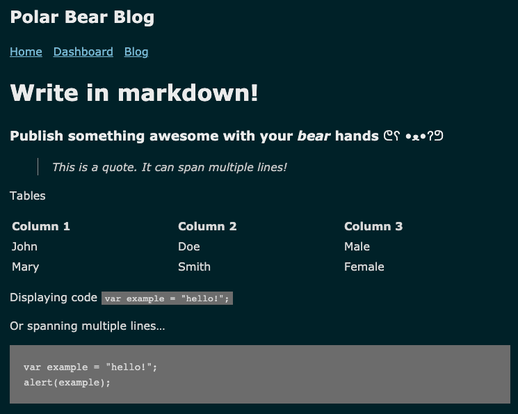
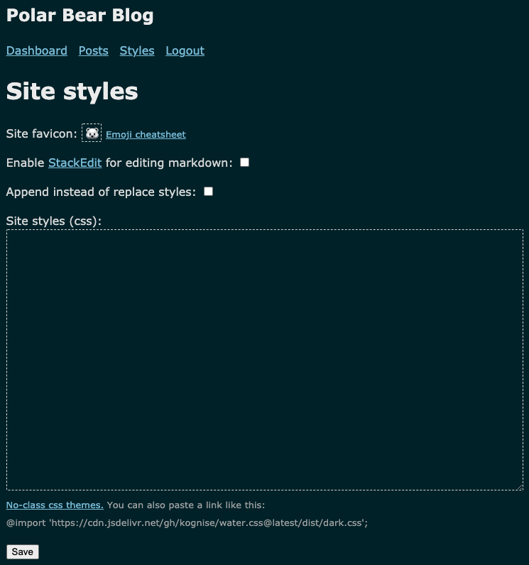
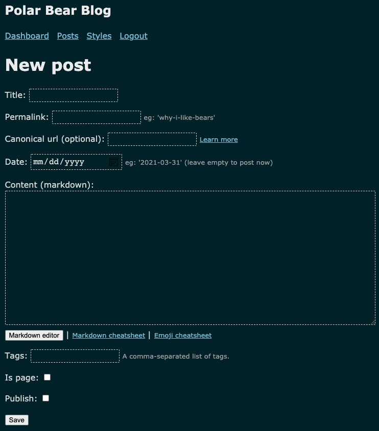
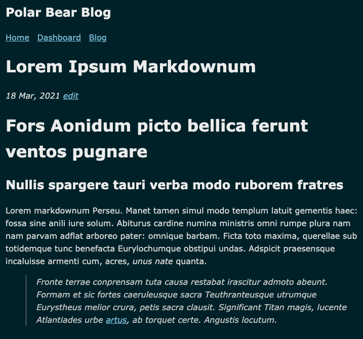
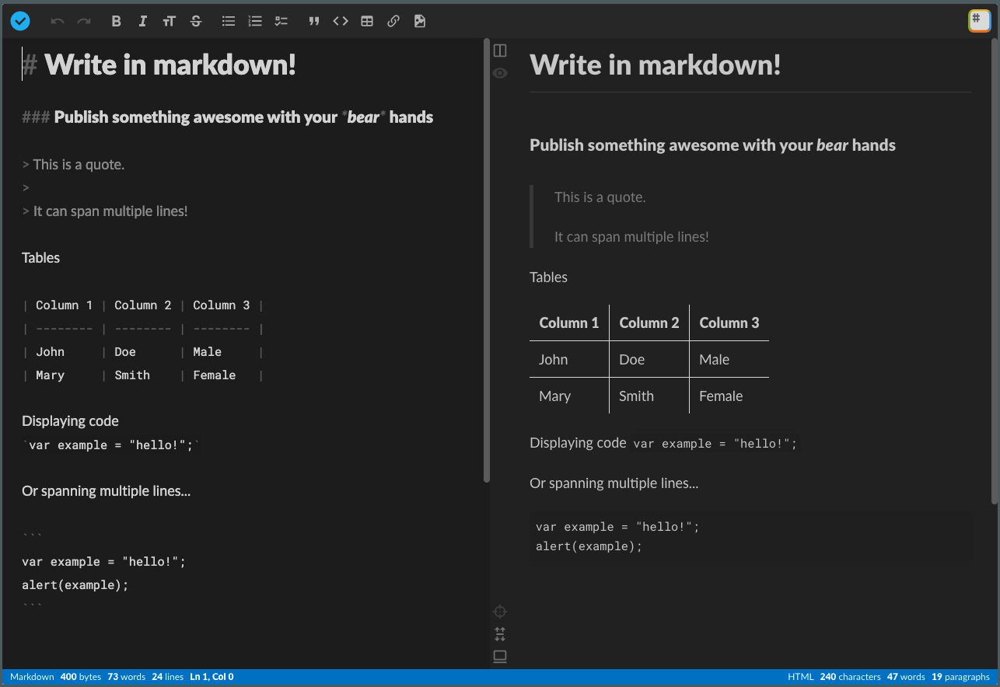

# Polar Bear Blog 🐻‍❄️

[](https://goreportcard.com/report/github.com/josephspurrier/polarbearblog)
[](https://godoc.org/github.com/josephspurrier/polarbearblog) 
[](https://github.com/josephspurrier/polarbearblog/actions)
[](https://coveralls.io/github/josephspurrier/polarbearblog?branch=main)

Lightweight blogging system for a single author. Written in Go and deploys to your own GCP project with a few commands. It's a derivative of the beautifully simple [Bear Blog 🐻](https://bearblog.dev/). The data storage and session storage are stored in Google Cloud Storage as objects. Depending on the traffic and blog size, it should (not guaranteed) cost less than $1 USD per month (compute and storage) to host this blog because it will be deployed to [Google Cloud Run](https://cloud.google.com/run/pricing) which bills to the nearest 100 millisecond. You can also [map your own domain name](https://cloud.google.com/run/docs/mapping-custom-domains) and Google will provide a free SSL certificate. This project uses `make` to simplify the deployment process.

You can see an active website using this stack [here](https://www.josephspurrier.com/). You can read the blog post on this project [here](https://www.josephspurrier.com/polar-bear-blog).

## Quickstart on Local

- Clone the repository: `git clone git@github.com:josephspurrier/polarbearblog.git`
- Create a new file called `.env` in the root of the repository with this content:

```bash
# App Configuration
## Session key to encrypt the cookie store. Generate with: make privatekey
export PBB_SESSION_KEY=
## Password hash that is base64 encoded. Generate with: make passhash passwordhere
export PBB_PASSWORD_HASH=
## Username to use to login to the platform at: https://example.run.app/login/admin
export PBB_USERNAME=admin
## Enable use of HTML in markdown editors.
export PBB_ALLOW_HTML=false
## GCP bucket name (this can be one that doesn't exist yet).
export PBB_GCP_BUCKET_NAME=sample-bucket
## Optional: enable MFA (TOTP) that works with apps like Google Authenticator. Generate with: make mfa
# export PBB_MFA_KEY=
## Optional: set the time zone from here:
## https://golang.org/src/time/zoneinfo_abbrs_windows.go
# export PBB_TIMEZONE=America/New_York

# GCP Deployment
## GCP project ID.
export PBB_GCP_PROJECT_ID=my-sample-project-191923
## Name of the docker image that will be created and stored in GCP Repository.
export PBB_GCP_IMAGE_NAME=sample-image
## Name of the Cloud Run service to create.
export PBB_GCP_CLOUDRUN_NAME=sample-service
## Region (not zone) where the Cloud Run service will be created:
## https://cloud.google.com/compute/docs/regions-zones#available
export PBB_GCP_REGION=us-central1

# MFA Configuration
## Friendly identifier when you generate the MFA string.
export PBB_ISSUER=www.example.com

# Local Development
## Set this to any value to allow you to do testing locally without GCP access.
## See 'Local Development Flag' section below for more information.
export PBB_LOCAL=true
```

- To generate the `PBB_SESSION_KEY` variable for .env, run: `make privatekey`. Overwrite the line in the `.env` file.
- To generate the `PBB_PASSWORD_HASH` variable for .env, run: `make passhash passwordhere`. Replace with your password. Overwrite the line in the `.env` file.
- To create the session and site files in the storage folder, run: `make local-init`
- To start the webserver on port 8080, run: `make local-run`

The login page is located at: http://localhost:8080/login/admin.

To login, you'll need:

- the username from the .env file for variable `PBB_USERNAME` - the default is: `admin`
- the password from the .env file for which the `PBB_PASSWORD_HASH` was derived

Once you are logged in, you should see a new menu option call `Dashboard`. From this screen, you'll be able to make changes to the site as we as the home page. To add new posts, click on `Posts` and add the posts or pages from there.

## Quickstart on GCP

By following these instructions, you can get a blog public easily:

- Create a Google GCP project
- Update the .env file with your information - see section above for content
- Run this command to initialize the store by creating the GCP bucket, enabling versioning, and then copying 2 blank files to the bucket: `make gcp-init`. You will need to have the [Google Cloud SDK installed](https://cloud.google.com/sdk/docs/install). You will also need a [service account key](https://console.cloud.google.com/apis/credentials/serviceaccountkey) downloaded on your system with an environment variable set to the JSON file like this: `GOOGLE_APPLICATION_CREDENTIALS=~/gcp-cloud-key.json`.
- Run this command to build the docker image, push to the Google repository, and then create a Cloud Run job: `make`.

Once the process completes in a few minutes, you should get a URL to access the website. The login page is located at (replace with your real URL): https://example.run.app/login/admin.

## Development

If you would like to make changes to the code, I recommend these tools to help streamline your workflow.

```bash
# Install air to allow hot reloading so you can make changes quickly.
curl -sSfL https://raw.githubusercontent.com/cosmtrek/air/master/install.sh | sh -s

# Install direnv and hook into your shell. This allows you to manage 
# https://direnv.net/docs/installation.html
```

Once you have `direnv` installed, create .envrc file. Update the `GOOGLE_APPLICATION_CREDENTIALS` variable to the correct location on your hard drive of the app credentials. You can generate and download a service account key from: https://console.cloud.google.com/apis/credentials/serviceaccountkey.

```bash
# Load the shared environment variables (shared with Makefile).
# Export the vars in .env into the shell.
export $(egrep -v '^#' .env | xargs)

export PATH=$PATH:$(pwd)/bin
export GOOGLE_APPLICATION_CREDENTIALS=~/gcp-cloud-key.json
```

You can then use this commands to test and then to deploy.

```bash
# Start hot reload. The web application should be available at: http://localhost:8080
air

# Upload new version of the application to Google Cloud Run.
make
```

### Local Development Flag

When `PBB_LOCAL` is set, the following things will happen:

- data storage will be the local filesystem instead of in Google Cloud Storage
- redirects will no be attempted so you can use localhost:8080
- MFA, if enable will accept any number and will always pass validation
- Google Analytics will be disabled if set
- Disqus and Cactus will be disabled if set

## Screenshots

### Home Page



### Dashboard


### Custom Styles



### Create a Post



### View a Post



### StackEdit


